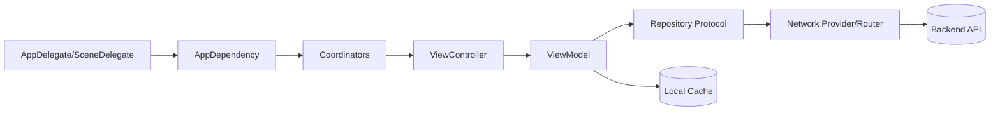
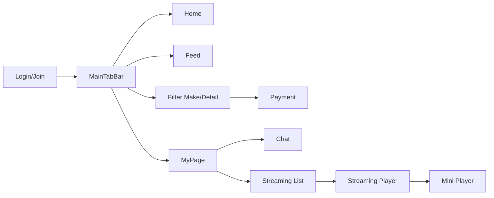
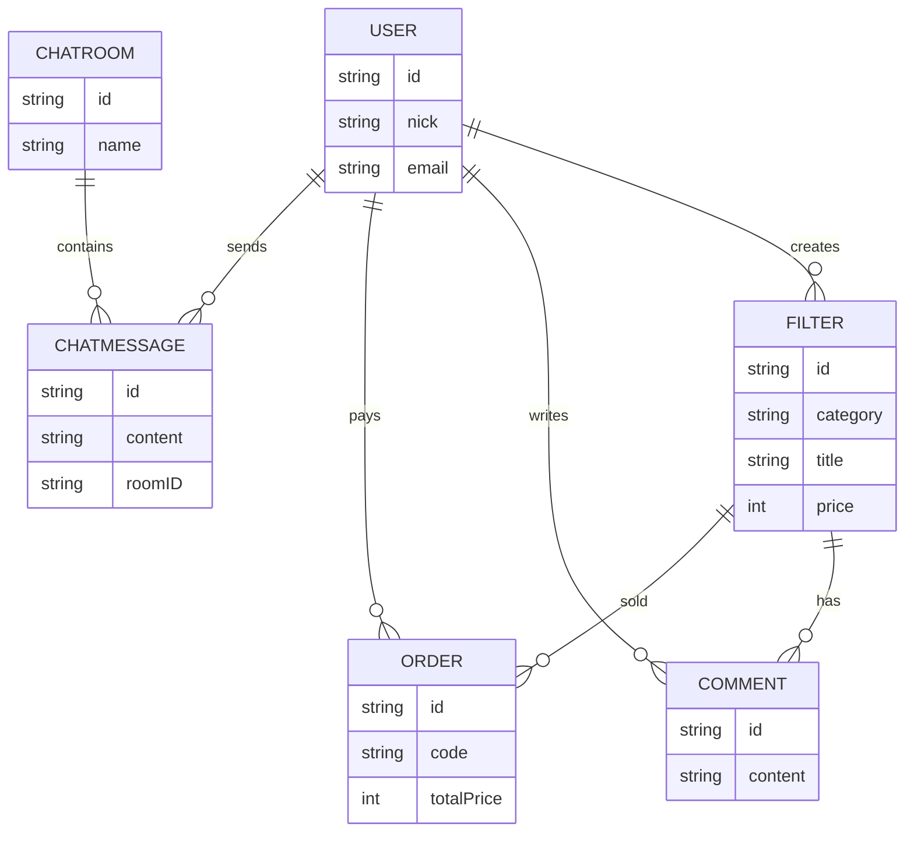
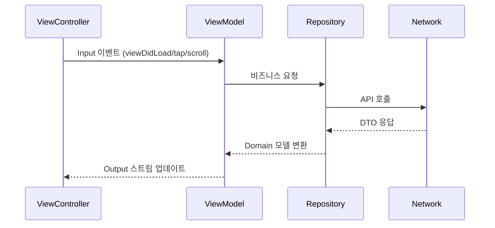
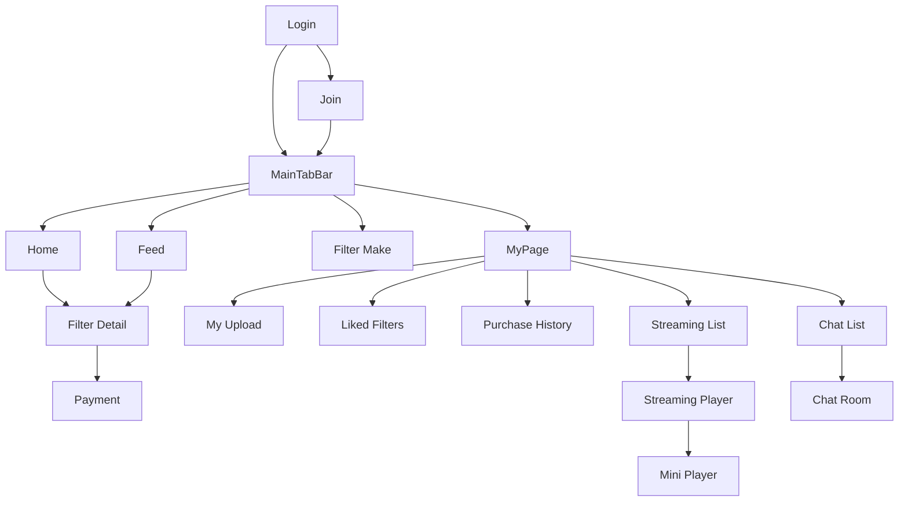

# 색안경

사진 필터를 제작/거래하고, 실시간 채팅과 스트리밍을 즐길 수 있는 UIKit 기반 iOS 앱입니다.  
MVVM + Coordinator 패턴과 Combine으로 화면 전환과 데이터 흐름을 분리하고, 네트워크/데이터 접근을 Repository로 모듈화했습니다.

- iOS 16+ / UIKit / Combine
- MVVM + Coordinator, Repository
- 스트리밍, 실시간 채팅, PG 결제, 푸시 알림

## 앱 스크린샷

| Login | Join | Home | Home - WebView Banner | Home - Banner Tap |
|------|------|---------|---------------|---------------|
|  |  |  |  |  |

| Home - Hot Trend | Home - Today's Author | Feed - Top Ranking | Feed - Filter Feed(list) | Feed - Filter Feed(block) |
|------|------|---------|---------------|---------------|
|  |  |  |  |  |

| Filter Detail - 1 | Filter Detail - 2 | Filter Detail - 3 | Filter Detail - 4 | PG Payment |
|------|------|---------|---------------|---------------|
|  |  |  |  |  | 

| Filter Make | Filter Make - 2 | Filter Make Edit | My Page | My Page Edit |
|------|------|---------|---------------|---------------|
|  |  |  |  | 

| My Page - Purchased History | My Page - Liked Filter | My Page - My Upload | My Page - My Chatting List | Chat Room |
|------|------|---------|---------------|---------------|
|  |  |  |  |  |

| Chat Room - Image Preview | Chat Room - File Preview | Streaming List | Streaming | Streaming - Full Screen |
|------|------|---------|---------------|---------------|
|  |  |  |  |  |

| Streaming - Full Screen 2 | Push Notification - 1 | Push Notification - 2 | Network Error - 1 | Network Error - 2 |
|------|------|---------|---------------|---------------|
|  |  |  |  |  |

---

## 기능 상세

### 인증/프로필
- 이메일 로그인/회원가입, 애플로 로그인
- 액세스 토큰 갱신 및 디바이스 토큰 등록
- 프로필 편집, 프로필 이미지 업로드

### 홈/피드
- 오늘의 필터, 웹뷰 배너, 핫트렌드, 오늘의 작가 추천
- 랭킹/리스트/블록 레이아웃 전환, 좋아요 기능

### 필터 제작/상세
- 이미지 업로드 + 메타데이터 기반 필터 등록
- 이미지의 밝기, 노출, 대비 등의 값을 실시간 수정하여 필터 제작
- 원본 이미지와 비교 뷰, 채팅, 구매 흐름

### 스트리밍
- 리스트/플레이어, 앱 전역 미니 플레이어 확장/축소
- HLS 재생(헤더 주입), 좋아요/조회수 표시

### 채팅
- 실시간 메시지 + 이미지, PDF 파일 전송
- Realm 로컬 캐시 + Socket.IO 동기화
- 푸시 알림으로 채팅방 라우팅

### 결제/구매
- PortOne(iamport) 결제 모듈 연동
- 구매 내역/결제 검증 흐름

---

## 아키텍처 요약

### 전체 구조

### 화면 전환 흐름

### 도메인 관계(개념 ERD)

---

## 데이터 흐름(Combine Input/Output)

---

## 기술 스택
- iOS 16+, UIKit, Combine
- MVVM + Coordinator, Repository 패턴
- Alamofire, Kingfisher, SnapKit
- Realm (채팅 로컬 저장소)
- Socket.IO (실시간 채팅)
- Firebase Messaging (푸시 알림)
- PortOne(iamport) 결제

---

## 구현 포인트

### 1) Combine 기반 Input/Output 설계
- ViewModel마다 `Input`/`Output` 타입을 정의해 스트림 의존성을 명확히 분리
- `BaseViewModel`에서 공통 로딩/에러 채널 제공

### 2) Coordinator로 화면 전환 책임 분리
- 인증/메인 탭/기능별 Coordinator로 네비게이션 분리
- 의존성 생성은 `AppDependency`에서 단일화

### 3) 네트워크 안정화
- `TokenRefreshInterceptor`로 401/419 응답 시 자동 재발급
- 실패 시 강제 로그아웃 알림 처리

### 4) 이미지/스트리밍 최적화
- Kingfisher ETag 캐싱으로 중복 다운로드 최소화
- `StreamingResourceLoader`로 HLS 요청 헤더 주입 및 자막 제어

### 5) 채팅 동기화
- Socket.IO 실시간 수신 + Realm 캐시 동기화
- 화면 재진입 시 로컬 메시지 즉시 렌더

---

## 핵심 모듈 상세

### Network Layer
- `NetworkProvider` + `APIRouter`로 공통 요청 흐름 구성
- `TokenRefreshInterceptor`에서 뮤텍스(`NSLock`) 기반 큐 액세스 토큰 리프레시 처리
- 갱신 중 발생한 요청은 큐에 적재 후 1회만 액세스 토큰 재발급 요청, 완료 시 큐에 적재된 요청 일괄 재시도
- Authorization 헤더/APIKey 헤더 자동 주입

### Streaming
- `StreamingPlaybackService`가 플레이어 상태를 중앙 관리
- 미니 플레이어가 서비스와 바인딩되어 재생 상태 공유
- `StreamingResourceLoader`가 HLS 요청에 헤더를 주입하고 자막 트랙을 제어

### Chat
- `ChatSocketClient`로 실시간 메시지 수신
- `ChatLocalStore`에서 Realm 캐시 관찰 및 UI 반영
- 채팅방 진입 시 Realm 캐시를 먼저 로드해 즉시 메시지 디스플레이
- 서버와 동기화 중에는 소켓 메시지를 버퍼링하고, 완료 후 일괄 저장
- 중복 메시지는 id 기준으로 차단하여 저장
- 소켓이 먼저 연결되어도 버퍼링으로 데이터 유실 최소화 로직 구현
- 푸시 알림 클릭 시 채팅방으로 라우팅

---

## 프로젝트 구조
- `SaegAngyeong/App`: 앱 라이프사이클, 의존성 주입, 네트워크 상태 관리
- `SaegAngyeong/Common`: 공통 UI, 베이스 클래스, 유틸리티
- `SaegAngyeong/Domain`: 모델, Repository 프로토콜
- `SaegAngyeong/Network`: API 라우터, DTO, Repository 구현
- `SaegAngyeong/Features`: 기능별 MVVM + Coordinator
- `SaegAngyeong/Resources`: 에셋, 폰트, Info.plist

---

## 주요 화면 흐름(상세)

---

## 실행 방법
1. Xcode에서 `SaegAngyeong.xcodeproj` 열기
2. `SaegAngyeong/App/Config/Secret.xcconfig`에 아래 값 설정
   - `BASE_URL`, `API_KEY`, `IAMPORT_USER_CODE`, `IAMPORT_PG`
3. `SaegAngyeong/Resources/InfoPlist/GoogleService-Info.plist`에 Firebase 설정 추가
4. iOS 16+ 시뮬레이터/디바이스에서 실행

---

## 설정 참고
- 네트워크 키 값은 Info.plist의 `$(API_KEY)`, `$(BASE_URL)`로 주입됩니다.
- 결제 연동은 PortOne(iamport) 설정이 필요합니다.
- 커스텀 폰트는 `SaegAngyeong/Resources/Fonts`에 포함되어 있습니다.

---

## 기술 선택 이유
- UIKit: 커스텀 UI와 레이아웃 제어에 유리
- Combine: 단방향 데이터 흐름과 비동기 처리 가독성 향상, 퍼스트파티 라이브러리(의존성 제거)
- MVVM + Coordinator: 화면 전환/비즈니스 로직 분리로 유지보수 용이, 푸시 알림과 화면 라우팅 조합 가능
- Alamofire/Kingfisher: 네트워킹/이미지 로딩 성숙도와 생산성
- Realm/Socket.IO: 실시간 채팅과 로컬 캐시 성능 확보

---

## 향후 개선 아이디어
- 테스트 타겟 추가 및 주요 ViewModel 단위 테스트
- 이미지 업로드/캐시 정책 정교화
- 스트리밍 품질 자동 전환 로직 고도화
